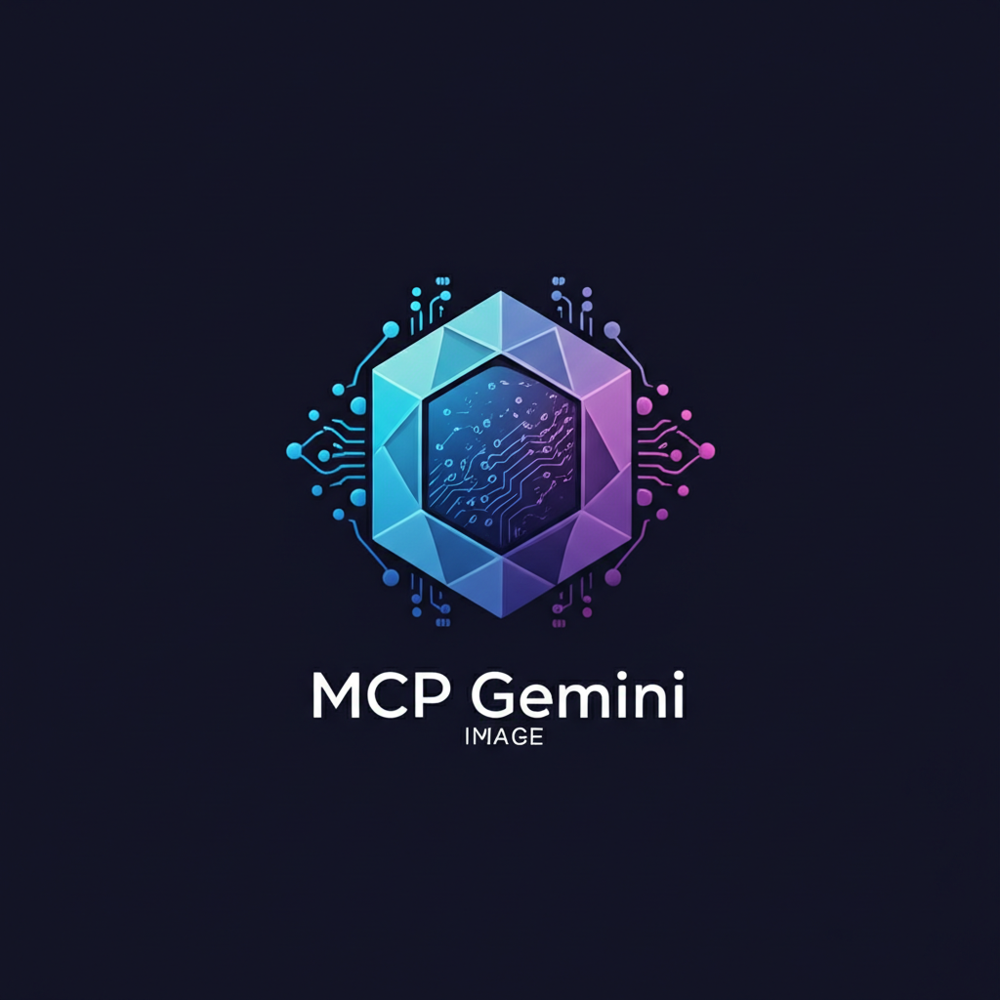

# MCP Google Gemini Image Generation Server

<div align="center">
  
  <p><em>Logo generated using Google Gemini via this MCP server</em></p>
</div>

[](https://github.com/AiondaDotCom/mcp-gemini-image/actions/workflows/ci.yml)
[](https://opensource.org/licenses/MIT)
[](https://nodejs.org/)
[](https://www.typescriptlang.org/)

A Model Context Protocol (MCP) server that provides Google Gemini image generation capabilities, specifically supporting the Imagen 4 model for high-quality image generation with enhanced text rendering and detailed imagery.

## Features

- **Imagen 4 Support**: Generate high-quality images using Google's latest Imagen 4 model
- **Multiple Models**: Support for both standard and ultra versions of Imagen 4
- **Flexible Parameters**: Configurable aspect ratios, number of images, and person generation settings
- **Automatic File Management**: Images are automatically saved to your Desktop
- **TypeScript**: Full TypeScript support with proper type definitions
- **MCP Protocol**: Seamless integration with MCP-compatible clients

## Installation

1. Clone this repository
2. Install dependencies:
   ```bash
   npm install
   ```
3. Build the project:
   ```bash
   npm run build
   ```

## Configuration

### API Key Setup

1. Get a Google API key from the [Google Cloud Console](https://console.cloud.google.com/)
2. Enable the Generative AI API for your project
3. Start the MCP server
4. Use the `configure-server` tool to set your API key before generating images
   - **Note**: Your API key will be automatically saved to `~/.mcp-gemini-image.json` for future use

## Usage

### Running the Server

```bash
npm start
```

### Available Tools

#### 1. `generate-image`
Generate images using Google Gemini Imagen 4.

**Parameters:**
- `prompt` (required): Text description of the desired image
- `model` (optional): Choose between `imagen-4.0-generate-preview-06-06` (default) or `imagen-4.0-ultra-generate-preview-06-06`
- `aspect_ratio` (optional): `square`, `portrait`, or `landscape` (default: `square`)
- `num_images` (optional): Number of images to generate (1-4 for standard, 1 for ultra) (default: 1)
- `person_generation` (optional): `dont_allow`, `allow_adult`, or `allow_all` (default: `allow_adult`)
- `filename` (optional): Custom filename for the saved image

**Example:**
```json
{
  "prompt": "A serene mountain landscape with a crystal clear lake reflecting the snow-capped peaks at sunset",
  "model": "imagen-4.0-generate-preview-06-06",
  "aspect_ratio": "landscape",
  "num_images": 2
}
```

#### 2. `configure-server`
Configure Google API credentials.

**Parameters:**
- `api_key` (required): Your Google API key
- `project_id` (optional): Your Google Cloud project ID

**Note**: Credentials are automatically saved to `~/.mcp-gemini-image.json` and will persist between server restarts.

**Example:**
```json
{
  "api_key": "your-google-api-key"
}
```

#### 3. `get-config-status`
Check the current configuration status of the server.

**Returns:**
- Configuration status
- Available models
- Image save directory

#### 4. `list-supported-models`
List all supported Google Gemini image generation models with their capabilities.

**Returns:**
- Model details
- Maximum number of images per model
- Model features

## Model Comparison

### Imagen 4 Standard (`imagen-4.0-generate-preview-06-06`)
- **Max Images**: 1-4 per request
- **Features**: High-quality, detailed images with good lighting
- **Best for**: General image generation, multiple variations

### Imagen 4 Ultra (`imagen-4.0-ultra-generate-preview-06-06`)
- **Max Images**: 1 per request
- **Features**: Enhanced quality and detail, premium version
- **Best for**: High-quality single images, professional use

## File Management

Images are automatically saved to:
- **Directory**: `~/Desktop/gemini-images/`
- **Format**: PNG files with timestamp
- **Metadata**: JSON files with generation parameters

## Error Handling

The server provides comprehensive error handling for:
- Invalid API credentials
- Model parameter validation
- Network connectivity issues
- File system errors

## Development

### Scripts

- `npm run build`: Build the TypeScript project
- `npm run dev`: Watch mode for development
- `npm run clean`: Clean build directory

### Project Structure

```
src/
├── index.ts            # Main entry point
├── server.ts           # MCP server implementation
├── config-manager.ts   # Configuration management
├── image-generator.ts  # Google Gemini API integration
├── file-manager.ts     # File operations
└── types.ts           # TypeScript definitions
```

## Requirements

- Node.js 18.0.0 or later
- Google API key with Generative AI API enabled
- TypeScript 5.0.0 or later

## License

MIT License

## Contributing

1. Fork the repository
2. Create your feature branch
3. Commit your changes
4. Push to the branch
5. Create a Pull Request

## Support

For issues and questions, please open an issue on the GitHub repository.

## Changelog

### v1.0.0
- Initial release with Imagen 4 support
- Basic image generation functionality
- Configuration management
- File management system